# Welcome to the Sliding Burger Game !

Developed by **Charly Flu**, **Paolo Hoogland** and **Tom Prieto**. This game is the result of our **object-oriented programming** and **information systems methodology** coursework.

Have fun !

# How to launch the game
## Windows 

Go to the directory ```WIN-SlidingBurgers-V1``` and launch **SlidingBurgers-V1.exe**
## MACOS
Go to the directory ```MACOS-SlidingBurgers-V1``` and lauch **SlidingBurgers-V1.app**

If there is a pop-up "SlidingBurgerV1" is damaged and cannot be opened. 


just open a terminal in the folder ```MACOS-SlidingBurgers-V1``` and execute the command ```xattr -rd com.apple.quarantine SlidingBurgerV1.app```


# How to play 

Sliding Burger is inspired by **Geometry Dash**, but with our own twists and original levels.


## Keys 

- **Jump :** Spacebar or left mouse click

## Sound effect & music 

You can adjust the music and sound effects volume from the Settings menu.
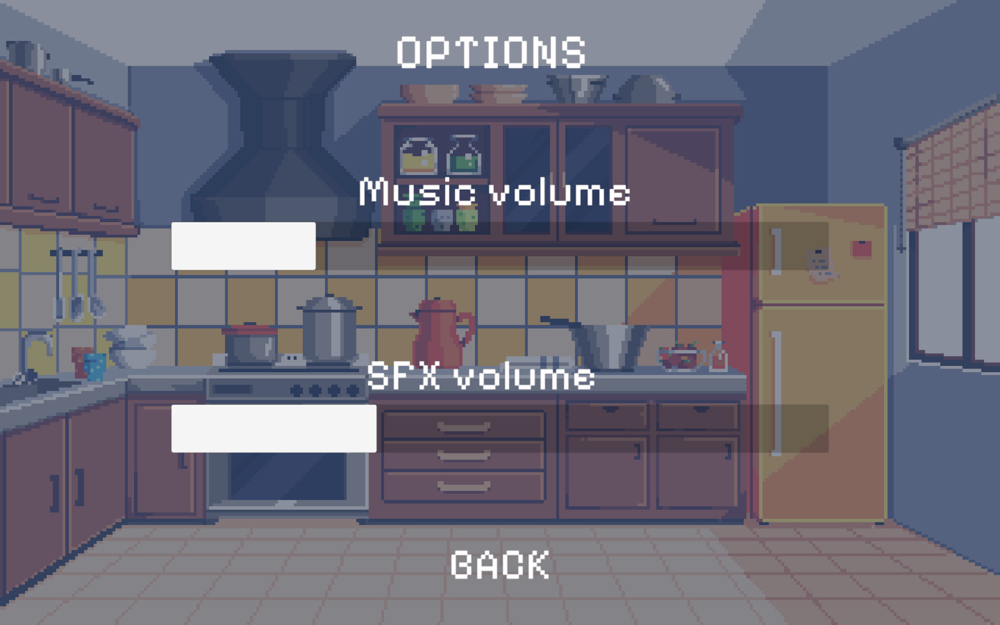

## Play a level 
Once you click the **"Play"** button on the main menu, you can choose the level you want to play from the level selection screen.  
Pick any available level and get ready to jump!

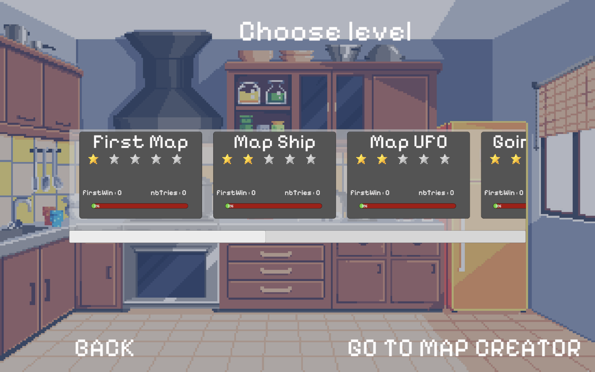

## Special sprites 

In **Sliding Burger**, some special sprites change the way the game is played. These elements add variety and challenge as you progress through the levels.

Here are the main ones:
- 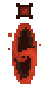 The normal portal is the default portal. It allows you to jump and move normally.
- 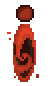 The UFO portal allows you to jump  in the air.
- 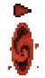 The JET portal allows you to fly in the air like a plane.
- 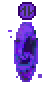 The gravity portal inverts the gravity. 
- 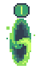 The speed portal "I" set the speed to 1.
- 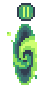 The speed portal "II" set the speed to 2.
- 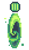 The speed portal "III" set the speed to 3.
-  The speed portal "IV" set the speed to 4.
- 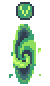 The speed portal "V" set the speed to 5.


## How to play

### Pan
You can see floating pan in the air. If you touch it, it'll throw you high in the air.
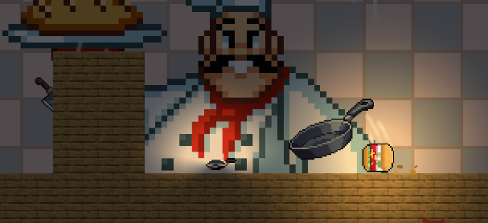
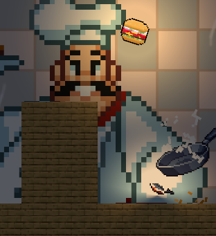

### Spike
You can see spikes on the ground. If you touch it, you'll die.
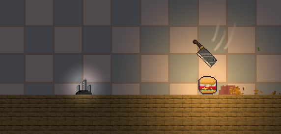
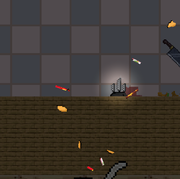

### Orb
Sometimes there are strange floating meat orbs. You can jump on them to double jump.
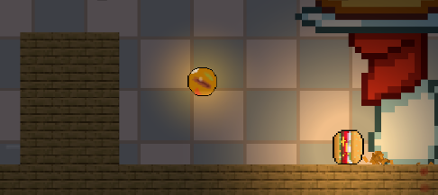
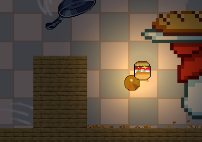
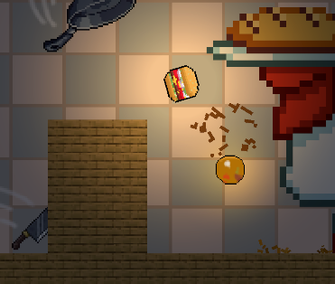

### Portals

Mysterious portals are scattered throughout the levels. Going through them will give you special powers (more on that later). This one inverts the gravity, allowing you to slide on the ceiling.
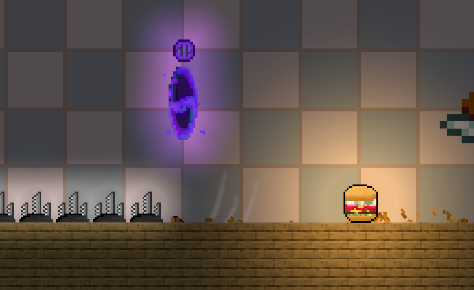
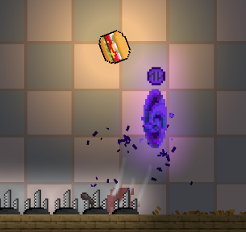
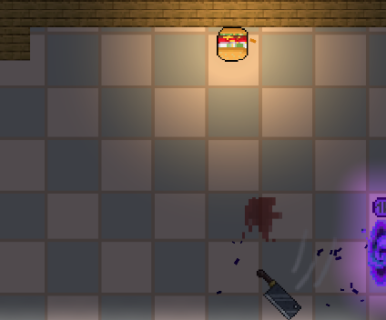

### Checkpoint
Floating packets are checkpoints. Touch them to save your progress. If you die, you'll respawn at the last checkpoint you touched.
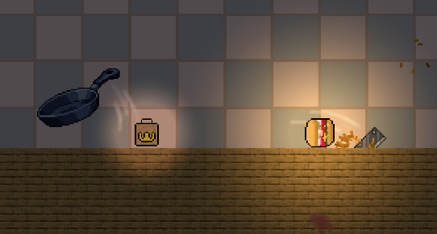
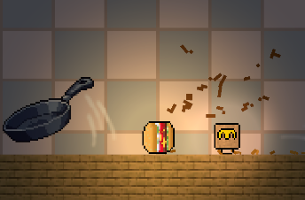

### End
A man is waiting for is food, touch him to sacrfice yourself and finish the level.

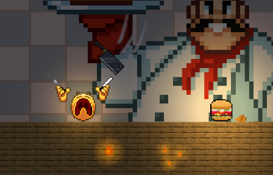


### Tricky double jump

For hard levels, you might need to do a tricky double jump.
To do this, you need to jump and aim for the corner of a block while keeping the jump button pressed. This will allow you to jump again.

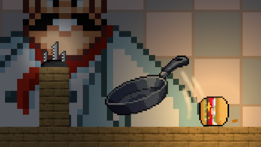
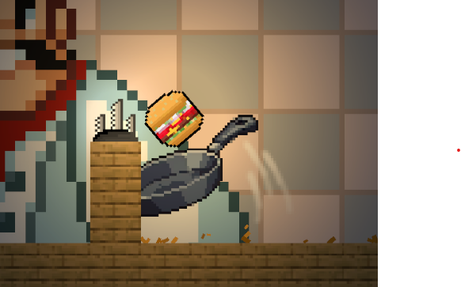
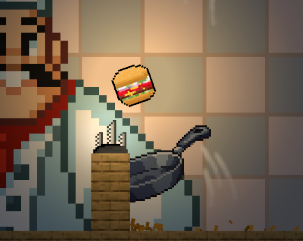


## Map editor
**Sliding Burger** includes a built-in **map editor** that allows you to create and test your own custom levels.

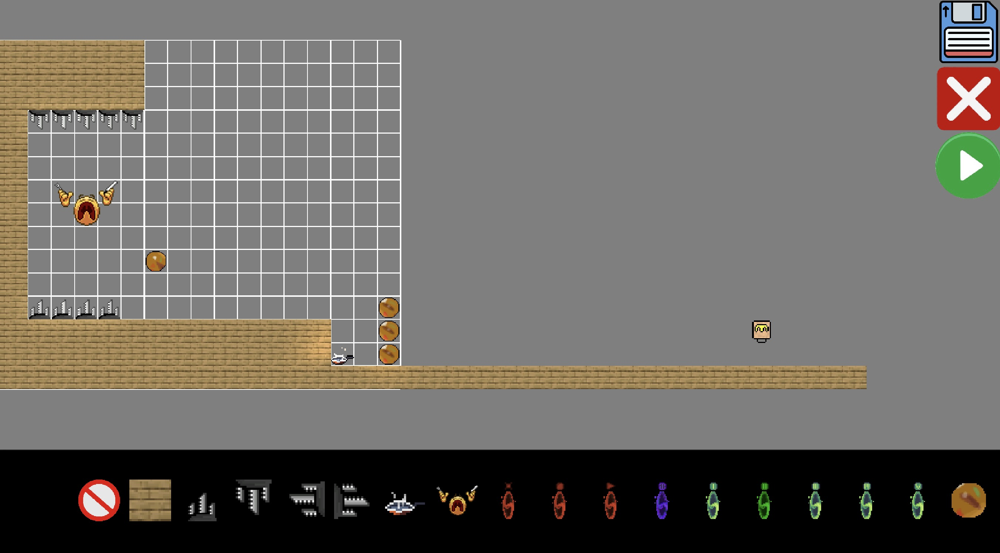

To access the map editor, click on the **Map Editor** button in the level selection screen. This will open the map editor interface, where you can create your own levels.

### Creating a level

To create a level, you can use the following tools:

- **Select**: Select an object to place in the level.
- **Delete**: Delete an object from the level.
- **Zoom**: Zoom in or out of the level.
- **Move**: Move the camera around the level.
- **Test**: Test the level you created.
- **Save**: Save the level you created.
- **Load**: Load a level you created.
- **Exit**: Exit the map editor.

The saved level will be then available in the level selection screen.

# Diagrammes 

## Diagramme d'état
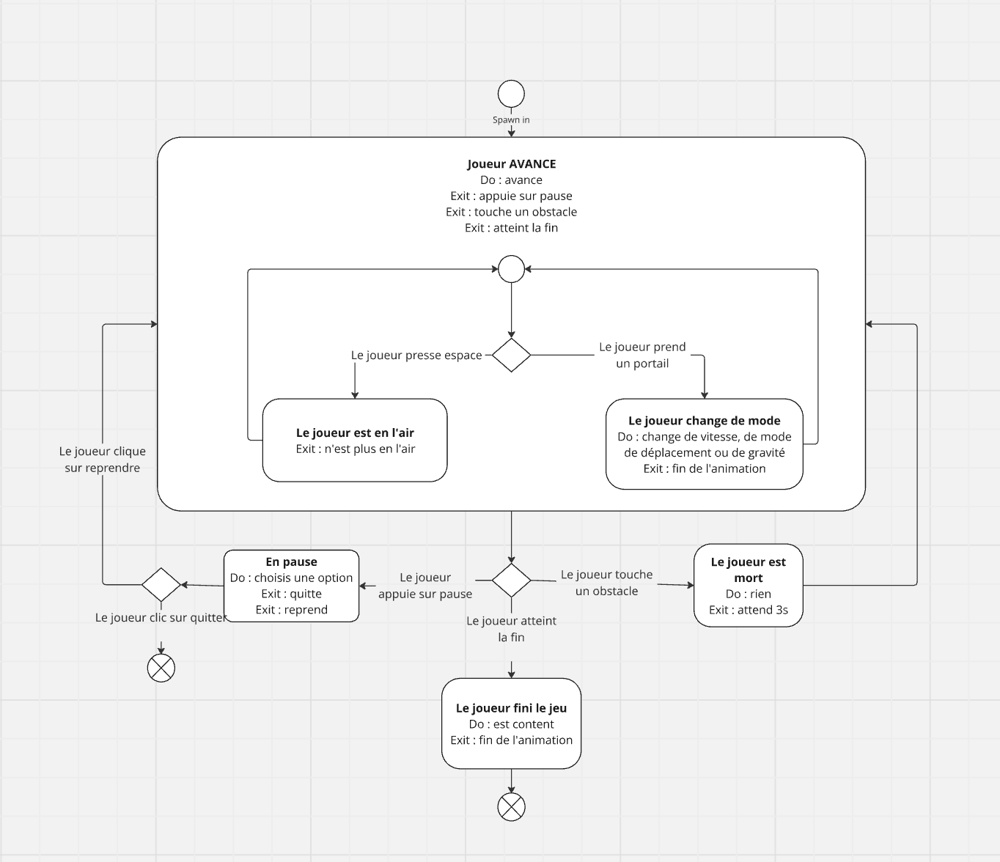

## Diagramme de cas d'utilisation 
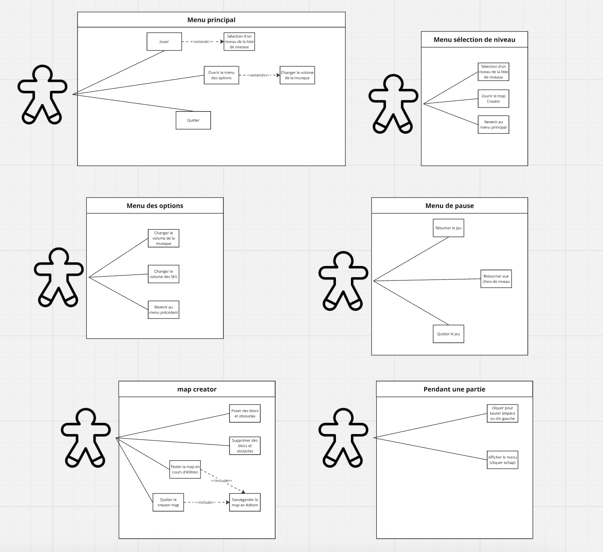


## Diagramme d'activité
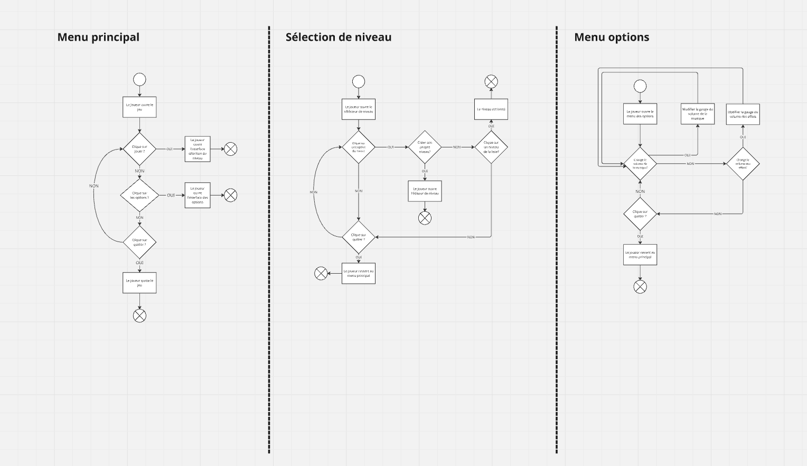
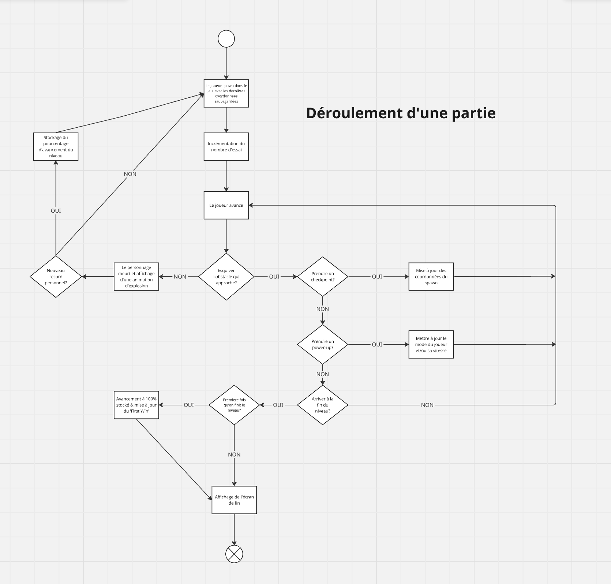
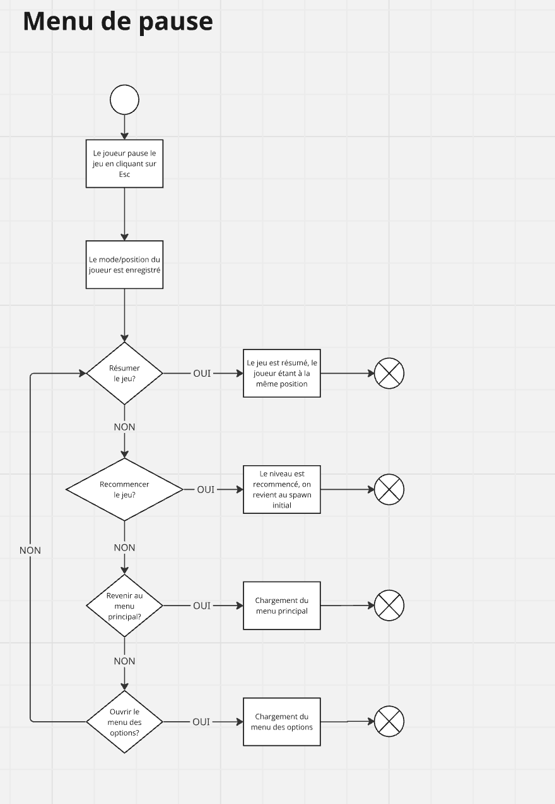

## Diagramme de classe complet 
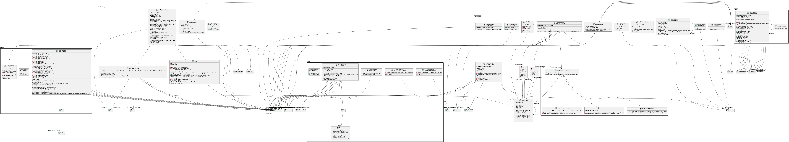
Note : Les classes possédant ```<<MonoBehavior>>``` héritent de MonoBehavior.

## Diagramme de classe centré sur le jeu et la map 
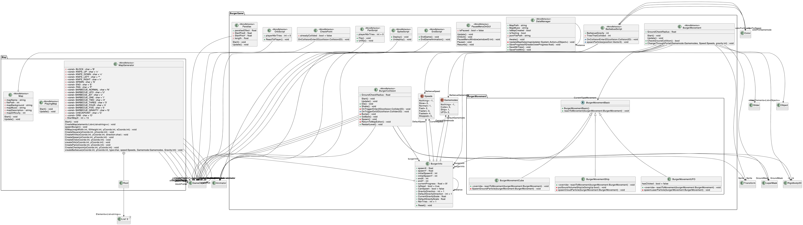

## Diagramme de classe centré sur l'audio et le menu 
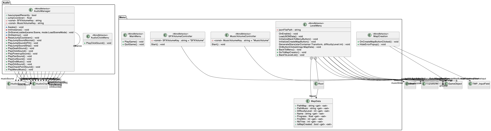

## Diagramme de classe centré sur le map editor 
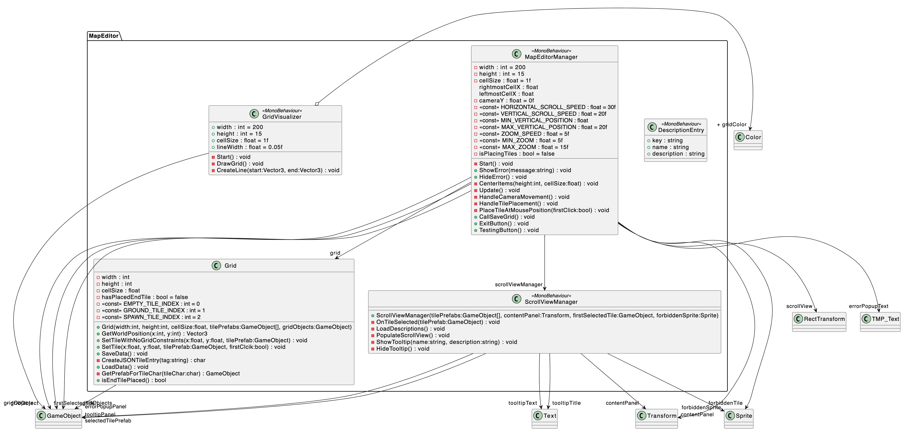

## Diagramme de GANT
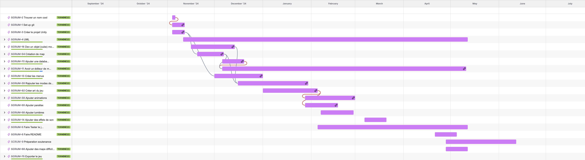


# Licence
Ce projet est soumis à la licence MIT. Se référer au document suivant : [LICENCE](LICENSE).


